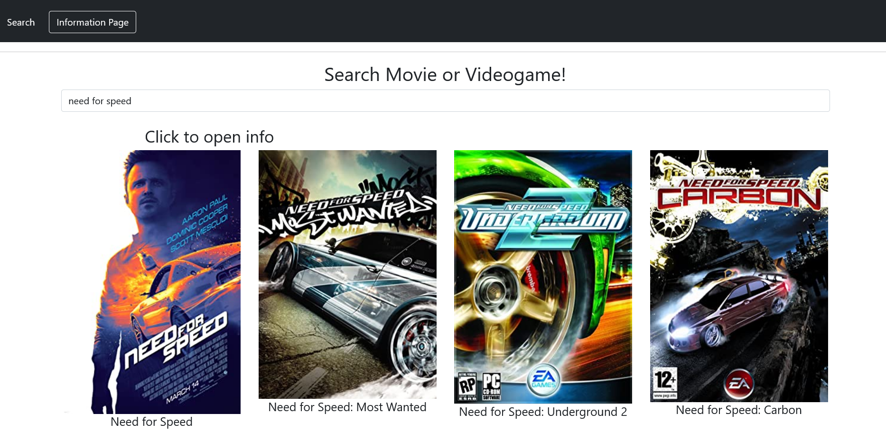

# Templates APP

GuestBook on sovellus, jolla voit tallentaa viestin luetteloon, eli kirjastoon. Kaikki tiedot tallennetaan JSON-tiedostoon. 

# ScreenShoot

# Installation

Lisään myöhemmin jotain lisää..

# Environment Variables

- `PORT`, Serverin portti on `4000`.

# Hostaus omalla koneella

1. Avaa VSC ohjelmalla kansio.

2. Asenna Terminaalissa `npm i express ejs morgan nodemon`.

3. Kirjoita terminaaliin `npm start`.

4. Heti kun saat asennettua ja startattua, vieraile sitten: `http://localhost:4000` selaimessa.

